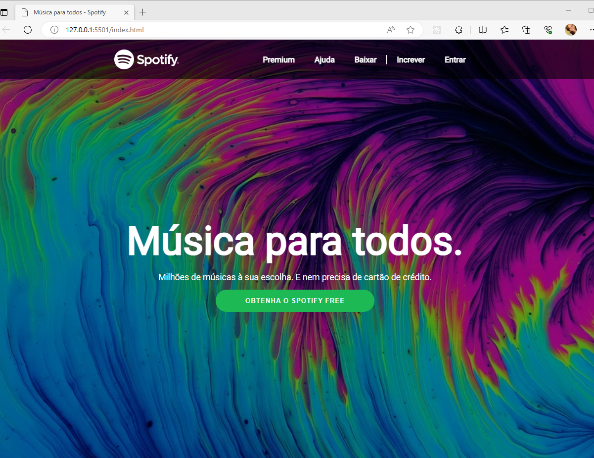

# Clone do Spotify (Front-End)

Bem-vindo ao projeto do Clone do Spotify!

## Exemplo visual do projeto

Assista a uma breve demonstração do projeto no vídeo abaixo:

[!(https://drive.google.com/file/d/1p7o1Hrh8MxAYFUUlDdlUaet1WdoXh--z/view?usp=sharing)]

## Descrição

Neste projeto, você terá a oportunidade de aprender e aplicar conceitos essenciais de desenvolvimento web, enquanto cria um clone do Spotify, uma renomada plataforma de streaming de música. O objetivo principal é desenvolver habilidades práticas na construção de interfaces de usuário atraentes, utilizando tecnologias como HTML e CSS.

## Benefícios do Projeto

- Aprendizado prático de conceitos de front-end.
- Desenvolvimento de habilidades em HTML e CSS.
- Experiência na construção de interfaces de usuário atraentes.

## Funcionalidades

O Clone do Spotify possui as seguintes funcionalidades básicas:

1. Barra de Navegação (Navbar): Uma barra de navegação contendo o logo do Spotify e links para as diferentes seções do site. Essa barra permite a fácil navegação entre as páginas e funcionalidades do clone.

2. Showcase: Implementação do showcase, onde é exibida uma imagem de destaque e um texto promocional. O showcase é uma seção atrativa que chama a atenção dos usuários e destaca as principais características do Spotify.

3. Rodapé (Footer): Criação do rodapé com links para seções adicionais, informações da empresa e links de redes sociais. O rodapé fornece informações adicionais sobre o Spotify e permite aos usuários acessarem recursos extras ou se conectarem através das redes sociais.

4. Estilização: Estilização cuidadosa dos diferentes componentes para que o visual fique o mais próximo possível do layout original do Spotify. Isso inclui a aplicação de cores, tipografia, espaçamento e outros elementos visuais para criar uma experiência de usuário coesa e agradável.

As funcionalidades mencionadas acima são os elementos essenciais do clone do Spotify, proporcionando uma experiência semelhante à plataforma original. No entanto, você também pode adicionar funcionalidades adicionais e personalizações de acordo com suas preferências e habilidades de desenvolvimento.

## Recursos

## Tecnologias Utilizadas

O projeto utiliza as seguintes tecnologias:

- HTML: para estruturar a página.
- CSS: para estilizar a interface.

## Como Executar o Projeto

Para executar o projeto localmente, siga as etapas abaixo:

1. Clone este repositório para o seu computador ou faça o download dos arquivos.

2. Abra o arquivo `index.html` em um navegador da web.

3. Explore o código-fonte para entender como as diferentes partes do projeto foram implementadas.

## Fonte das Fotos

As fotos utilizadas neste projeto foram obtidas a partir dos seguintes links:

- [brazil.png](https://imagepng.org/bandeira-do-brasil/)
- [logo.png](https://storage.googleapis.com/pr-newsroom-wp/1/2018/11/Spotify_Logo_CMYK_White.png)
- [showcase.jpeg](https://www.pexels.com/pt-br/foto/papel-de-parede-4k-wallpaper-4k-abstrato-resumo-5186869/)

Certifique-se de verificar as licenças e direitos autorais das imagens antes de utilizá-las em seu projeto. Respeite as condições de uso e atribua os créditos necessários, se aplicável.

## Contribuição

Contribuições são bem-vindas! Sinta-se à vontade para enviar pull requests com melhorias, correções de bugs ou novas funcionalidades para este projeto.

## Licença

Este projeto está licenciado sob a [MIT License](LICENSE).

Aproveite esta oportunidade de aprender e desenvolver suas habilidades em desenvolvimento web. Divirta-se criando o seu próprio Clone do Tinder e explore as possibilidades de criação de interfaces atraentes e responsivas.
